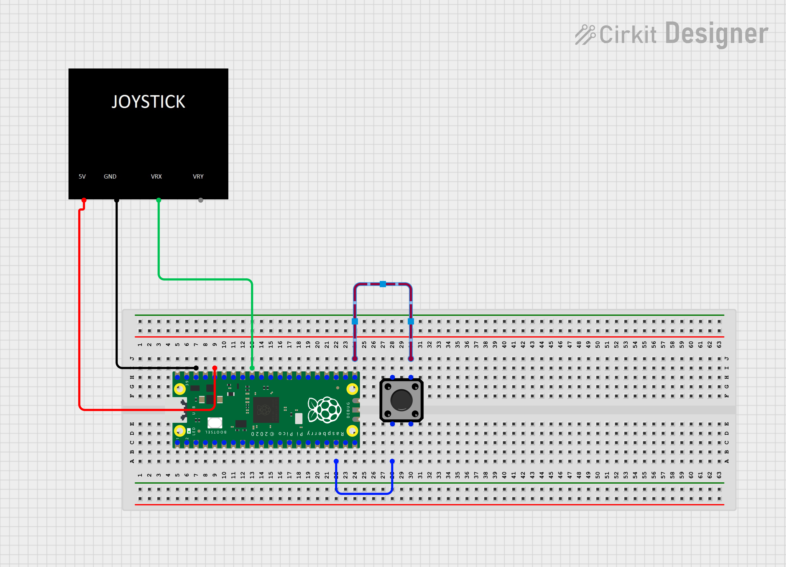

# Ce projet a été réalisé par Gaspard Castagnet et Ambroise Piétu

Il s'agit d'un jeu de puissance quatre, jouable avec un stick et un bouton

Pour visionner la vidéo, ouvrez le dossier img_video

Voici le shéma du branchement de notre projet 

# Fonctionnement 

Si le boutton est appuyé, on met à jour la variable "isPressed" à "yes", sinon "false". (une solution d'optimisation serrait de mettre la valeur "true" ou "false", de ce fait il n'y aurrait pas besoin de faire une verification dans le code qui suit)

De plus, après avoir verifié si le boutton à etait appuyé, on vérifie si le joystick a été deplacer sur la gauche ou droite, ou si il n'a pas bougé, et on met a jour la valeur de "side".

Une fois les verifications faites, on envoie une requete POST avec comme valeur, en json, "side" et "isPressed".

La requête met à jour la valeur de currentSide et isPressed avec les valeurs reçu.

Grace à ca, lors de la requête GET de "http://localhost:3000/side" on récupère les valeurs de currentSide et isPressed.

currentSide nous permettra donc de déplacer le "curseur" du joueur (représenté par le cercle en violet) en verifiant si, la valeur de currentSide, est égale à gauche, droite ou milieu.

La valeur de isPressed, si elle est égale à "yes", ferra un event click sur la position actuelle du joueur et donc "posera" un pion.

Après cela, la postion du joueur retourne à celle d'origine, et c'est au tour du joueur suivant.
